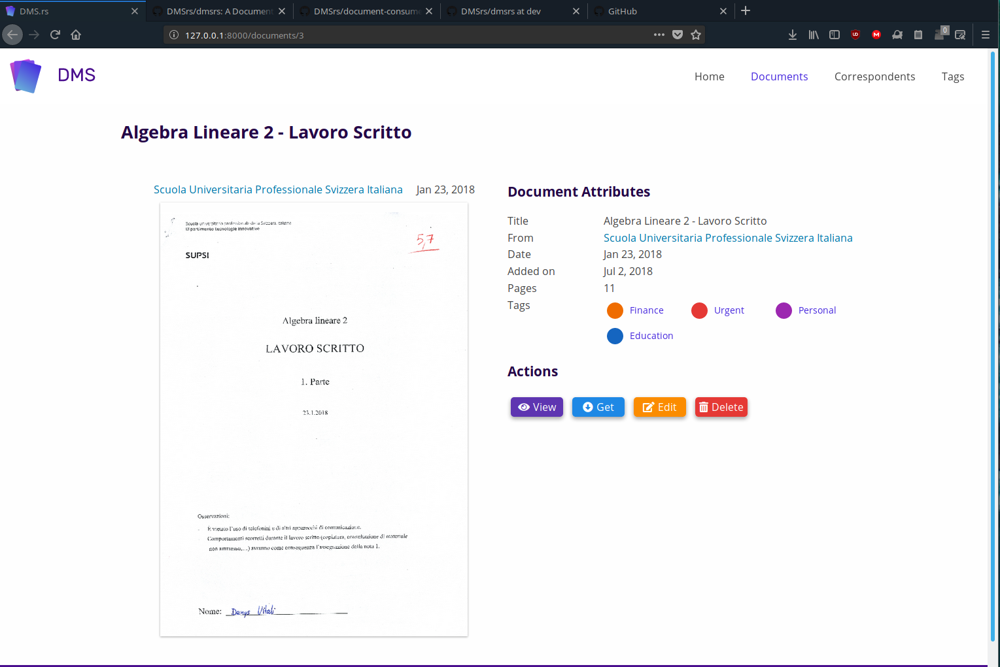

<p align="center"></p>

# DMS.rs
A Document Management System, written in Rust

## Requirements
- Rust Nightly
- Webpack
- Yarn
- libtesseract

## Instructions
```
yarn
webpack
docker run --name postgres-dmsrs -e POSTGRES_PASSWORD=default postgres:11-alpine
cargo run
```

Check that the IP in `main.rs` corresponds to the one returned by `docker inspect postgres-dmsrs | jq '.[].NetworkSettings.IPAddress' -r`.

### Import SQL DB
Since we currently have no SQL Schema generated by the application, you'll have to import this demo SQL file: [dmsrs-demo.sql](https://denv.it/public/dmsrs-demo.sql) with the following command:
```
docker cp dmsrs-demo.sql postgres-dmsrs:/tmp
docker exec -it postgres-dmsrs sh

$ psql -U postgres < /tmp/dmsrs-demo.sql
Password for user postgres:     (Insert "default" here)
$ exit
```

## Screenshots 

### Documents view


### Single Document View
